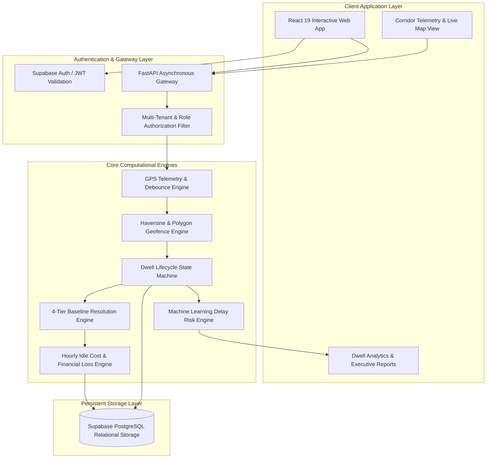

<div align="center">

# 🚛 Turnaround
### Operational Intelligence Platform for Commercial Fleet & Corridor Logistics


<br />


[](https://fastapi.tiangolo.com)
[](https://react.dev)
[](https://www.typescriptlang.org)
[](https://supabase.com)
[](https://tailwindcss.com)
[](LICENSE)

*Real-time fleet dwell monitoring, geofence cost tracking, and turnaround analytics for commercial trucking corridors across East Africa.*

[Product Capabilities](#-product-capabilities) • [GPS Integration](#-gps-integration) • [System Architecture](#-system-architecture) • [Core Engine Modules](#-core-engine-modules) • [Data Lifecycle & Pipeline](#-data-lifecycle--pipeline) • [Role-Based Access Control](#-role-based-access-control-rbac)

</div>

---

## 📋 Executive Summary

**Turnaround** is a mission-critical fleet operational intelligence and dwell optimization platform engineered specifically for commercial haulage corridors across East Africa (e.g., Mombasa Port $\leftrightarrow$ Nairobi ICD $\leftrightarrow$ Malaba OSBP $\leftrightarrow$ Kampala / Kigali).

In cross-border trucking, unexplained dwell times at weighbridges, container depots, customs yards, and customer facilities generate substantial unrecovered idle costs and severe SLA penalties. Turnaround solves this by transforming continuous GPS telemetry streams into real-time financial transparency, automated bottleneck classification, and predictive turnaround analytics.

---

## 👤 Creator & Lead Developer

**Turnaround** was created and developed by **Iddy K. Chesire**, known online as **[@acunetix2](https://github.com/acunetix2)**.

The platform brings together product design, fleet operations workflows, GPS intelligence, geofencing, dispatch management, analytics, and full-stack engineering into one logistics operations system for East African corridors.

<div align="center">

### Built by Iddy K. Chesire · @acunetix2

*Turning complex fleet operations into clear, actionable intelligence.*

</div>

---

## 🚀 Product Capabilities

Turnaround brings the main operating resources and decisions into one workspace:

- **Operations dashboard:** fleet activity, trip progress, dwell exposure, alerts, and cost indicators.
- **Carrier assets:** category-aware workflows for trucks, tankers, trailers, chassis, ships, and containers.
- **Corridor tracker:** MapLibre live map with vehicle status, speed, heading, facility markers, and route context.
- **Fleet directory:** Top 10 vehicle tracker with expandable driver, co-driver, availability, and GPS details.
- **Trip dispatch:** vehicle, route, schedule, cargo, customs seal, and available-container assignment.
- **Dwell intelligence:** geofence events, expected-vs-actual dwell, bottleneck classification, and delay risk.
- **Financial visibility:** excess dwell minutes, operating cost estimates, and demurrage indicators.

Containers are modeled as cargo equipment and are not assigned drivers. Powered vehicles can have drivers and co-drivers; containers have their own registry, status, type, and assignment lifecycle.

## 🧰 Technology Stack

| Layer | Technologies |
|---|---|
| Frontend | React 19, TypeScript, Vite, Tailwind CSS |
| UI and forms | React Hook Form, Zod, Lucide React |
| Data fetching | TanStack React Query |
| Maps | MapLibre GL, OpenStreetMap, CARTO |
| Backend | Python, FastAPI, Uvicorn |
| Database | PostgreSQL hosted by Supabase |
| ORM and migrations | SQLAlchemy 2, asyncpg, Alembic |
| Authentication | Supabase Auth with backend-managed sessions |
| Notifications | Firebase Cloud Messaging |

## 📡 GPS Intelligence Flow

Turnaround turns location signals into practical operational decisions without requiring dispatchers to interpret raw tracking data.

```text
Vehicle movement
   ↓
Location awareness
   ↓
Facility and corridor recognition
   ↓
Arrival, dwell, and departure understanding
   ↓
Expected time comparison
   ↓
Delay, cost, and risk visibility
   ↓
Faster dispatcher action
```

### How the flow works

1. **Movement is observed:** The system receives location signals from connected fleet assets.
2. **Context is added:** Each position is understood in relation to ports, depots, warehouses, border posts, weighbridges, and planned routes.
3. **Operational states are identified:** The platform distinguishes movement, arrival, active dwell, and departure.
4. **Performance is compared:** Actual time at a facility is compared with the expected operating baseline.
5. **Business impact is explained:** Excess time is translated into delay exposure, operating cost, SLA risk, and possible demurrage.
6. **Teams take action:** Dispatchers and fleet managers use the shared operating picture to prioritize the next intervention.

The goal is simple: transform an invisible delay into a visible, understandable, and actionable event.

## ✉️ Email Confirmation

Production signup uses Supabase email confirmation:

1. The user signs up and receives a Supabase email.
2. The email opens the public `/confirm-email` page.
3. The user clicks **Confirm email**.
4. Turnaround verifies the token and shows a success state.
5. The user continues to `/login`.

Add the deployed frontend origin and `/confirm-email` to the Supabase Authentication URL allow list. Set the backend `FRONTEND_URL` to the same frontend origin.

## 🧪 Demo Workflow

1. Sign in as an administrator or fleet manager.
2. Register a powered vehicle under Carrier Assets.
3. Register a container separately; do not assign it a driver.
4. Configure a facility and geofence.
5. Dispatch a trip with a vehicle, route, schedule, and available container.
6. Open Corridor Tracker and inspect the Top 10 fleet panel.
7. Expand a vehicle to review driver, co-driver, availability, and GPS state.
8. Ingest GPS events or enable mock data to simulate movement.
9. Review dwell, delay, analytics, and financial impact screens.

---

## 🏗️ System Architecture



---

## ⚙️ Core Engine Modules

### 1. Spatial Geofencing & Telemetry Ingestion Engine
- **Geodesic Spatial Computations**: Employs the Haversine geodesic formula ($R = 6,371,000\text{ m}$) for high-precision spherical proximity validation without equator projection distortion.
- **Complex Polygon Boundaries**: Integrates planar polygon buffer topology for irregularly shaped container terminals, port berths, and bonded warehouses.
- **GPS Telemetry Debounce Mechanism**: Requires consecutive confirmative coordinates outside geofence thresholds to prevent erratic state oscillation when vehicles park adjacent to facility perimeter fences.

---

### 2. Dwell Lifecycle State Machine
- **Event Lifecycle Tracking**: Tracks precise vehicle state transitions: `IN_TRANSIT` $\to$ `ARRIVED` $\to$ `DWELLING` $\to$ `DEPARTED`.
- **Active Dwell Monitoring**: Computes ongoing dwell durations in real time for vehicles currently inside facility boundaries before departure records are finalized.
- **Trip Association**: Dynamically correlates arrival events with active freight manifests and planned origin-destination routes.

---

### 3. 4-Tier Expected Dwell Resolution Engine
To determine whether an ongoing or completed dwell constitutes an operational delay, the system resolves baseline expectations through a hierarchical four-tier evaluation chain:

```
┌────────────────────────────────────────────────────────────┐
│ Tier 1: Historical Median (If Location Visits ≥ 10)        │
├────────────────────────────────────────────────────────────┤
│ Tier 2: Location-Specific Operational SLA Target           │
├────────────────────────────────────────────────────────────┤
│ Tier 3: Customer Contractual SLA Agreement                 │
├────────────────────────────────────────────────────────────┤
│ Tier 4: Global Corridor Baseline (Default: 120 minutes)    │
└────────────────────────────────────────────────────────────┘
```

---

### 4. Financial Cost & Excess Dwell Quantification Engine
- **Tractor Operating Cost Matrix**: Calculates exact financial losses per incident by combining individual vehicle operating hourly rates ($C_{\text{hourly}}$) with quantified excess dwell time:
$$\text{Financial Loss} = \max(0, \text{Actual Dwell} - \text{Expected Dwell}) \times \frac{C_{\text{hourly}}}{60}$$
- **Severity Scoring Model**:
  - 🟢 **LOW**: $\text{Actual Dwell} \le 1.2 \times \text{Expected Dwell}$
  - 🟡 **MEDIUM**: $1.2 \times \text{Expected Dwell} < \text{Actual Dwell} \le 1.5 \times \text{Expected Dwell}$
  - 🔴 **HIGH**: $\text{Actual Dwell} > 1.5 \times \text{Expected Dwell}$

---

### 5. Predictive Delay & Bottleneck Intelligence Engine
- **Pre-Arrival Turnaround Estimation**: Predicts expected turnaround durations based on time of day, day of week, seasonal congestion, and recent queue lengths.
- **Automated Root Cause Classification**: Identifies and tags chronic bottleneck patterns:
  - `EXCESSIVE_DWELL`: Prolonged loading/unloading exceeding contractual SLA.
  - `RECURRING_BOTTLENECK`: Systemic facility delays across multiple carrier fleets.
  - `GATE_HOLD`: Terminal gate processing delays and documentation holdups.
  - `WEIGHBRIDGE_CONGESTION`: Axle-load verification delays on primary transit highways.
  - `SLA_BREACH`: Imminent or finalized contractual delay penalty risk.

---

### 6. Corridor Analytics & Fleet Visualization Module
- **Live Fleet Tracking**: Real-time geospatial corridor visualization showing animated fleet positions, speed, heading, and live dwell badges.
- **Facility Benchmarking**: Comparative analysis of turnaround efficiency across ports (Kilindini), inland dry ports (Nairobi ICD), and One-Stop Border Posts (Malaba, Namanga, Busia).
- **Executive Loss Dashboards**: Aggregated financial metrics, cumulative monthly dwell loss, truck utilization rates, and turnaround trend analysis.

---

## 🔄 Data Lifecycle & Pipeline

```
1. TELEMETRY STREAM
   GPS Device ──► Coordinate Payload (Lat, Lon, Speed, Heading, Timestamp)

2. SPATIAL CLASSIFICATION
   Geofence Matcher ──► Geodesic Distance / Polygon Containment Check

3. STATE RESOLUTION
   Debounce Validator ──► Entry / Exit Event Transition Confirmation

4. BENCHMARKING & AUDIT
   4-Tier Engine ──► Baseline Resolution & Excess Minutes Calculation

5. FINANCIAL ASSESSMENT
   Cost Model ──► Operating Rate Applied ──► Real-Time Cost Accumulation

6. ACTIONABLE INTELLIGENCE
   Insights Engine ──► Alert Dispatched ──► Dispatcher Mitigation
```

---

## 🛡️ Role-Based Access Control (RBAC)

The system enforces strict multi-tenant isolation through tenant keys (`company_id`), ensuring data privacy across independent logistics operators.

| Role | Operational Scope & Permissions |
|---|---|
| **Administrator** | Organization provisioning, billing, system configuration, user lifecycle management. |
| **Fleet Manager** | Vehicle asset registry, location & geofence setup, financial loss tracking, root-cause insights. |
| **Dispatcher** | Live corridor map monitoring, active trip routing, immediate dwell incident mitigation. |
| **Data Analyst** | Historical turnaround reporting, terminal KPI benchmarking, cross-corridor efficiency exports. |

---

## 🌍 Corridor Intelligence & Regional Context

Turnaround is purpose-built for the northern and central logistics corridors across Eastern Africa:

- **Mombasa Port (Kilindini Terminal)**: Real-time container yard dwell tracking and gate clearance monitoring.
- **Nairobi Inland Container Depot (ICD)**: Last-mile haulage and rail-to-road turnaround auditing.
- **Malaba & Busia One-Stop Border Posts (OSBP)**: Cross-border customs, transit bond, and axle-load verification dwell management.
- **Athi River & Gilgil Weighbridges**: Transit weighbridge delay quantification.

---

## 📄 License & Intellectual Property

Copyright © 2026 Turnaround Logistics Systems. All rights reserved. Proprietary software for commercial fleet logistics optimization.
