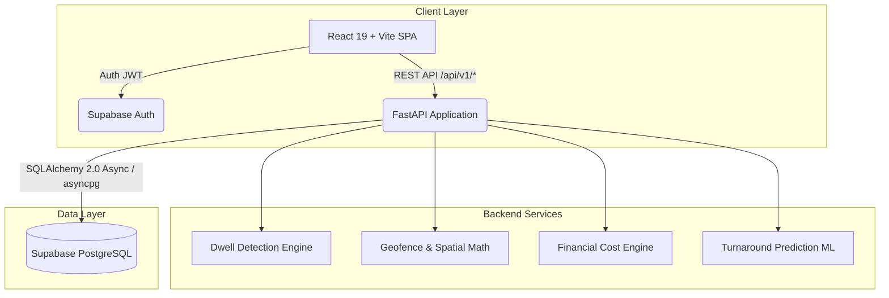

<div align="center">

# 🚛 Turnaround
### Operational Intelligence Platform for Commercial Fleet & Corridor Logistics

[](https://fastapi.tiangolo.com)
[](https://react.dev)
[](https://www.typescriptlang.org)
[](https://supabase.com)
[](https://tailwindcss.com)
[](LICENSE)

*Real-time fleet dwell monitoring, geofence cost tracking, and turnaround analytics for commercial trucking corridors across East Africa.*

[Features](#-key-features) • [Architecture](#-architecture) • [Quick Start](#-quick-start) • [Database & Migrations](#-database--migrations) • [API Documentation](#-api-endpoints) • [Tech Stack](#-tech-stack)

</div>

---

## 📖 Overview

**Turnaround** is a high-performance logistics intelligence platform designed to eliminate operational bottlenecks, reduce vehicle dwell times, and quantify financial losses across major freight corridors (such as Mombasa Port $\leftrightarrow$ Nairobi ICD $\leftrightarrow$ Malaba OSBP $\leftrightarrow$ Kampala).

By fusing high-frequency GPS telemetry with intelligent spatial geofencing and historical turnaround baselines, Turnaround automatically detects dwell anomalies, flags border and weighbridge delays, and empowers dispatchers and fleet managers to act before SLA penalties accumulate.

---

## ⚡ Key Features

- 🛰️ **Real-Time GPS Telemetry Stream**: High-throughput GPS ingestion with geodesic debounce windowing to eliminate boundary fence oscillations.
- 📍 **Intelligent Geofence Engine**: Haversine circular proximity detection + Shapely planar polygon geofences for terminals, ICDs, and border crossings.
- ⏱️ **4-Tier Expected Dwell Resolution**: Dynamically calculates baseline dwell based on (1) Historical visits ($\ge 10$), (2) Location SLA configs, (3) Customer SLA contracts, or (4) Global corridor defaults.
- 💰 **Financial Impact Engine**: Calculates real-time idle vehicle cost accruals based on custom tractor unit hourly operating costs (e.g. Scania G460, Volvo FH16).
- 🧠 **Predictive Delay & Risk Scoring**: Early warning models for corridor bottlenecks, gate holds, and customs clearance delays.
- 🗺️ **Interactive Operations Map**: Live corridor visualization powered by Leaflet, animated fleet clusters, and dwell severity color coding.
- 🛡️ **Multi-Tenant Isolation & RBAC**: Strict tenant boundaries (`company_id`) with role-based permissions (`admin`, `fleet_manager`, `dispatcher`, `analyst`).

---

## 🏗️ Architecture



---

## 🛠️ Tech Stack

### Frontend (`/turnaround-frontend`)
- **Core**: React 19, TypeScript, Vite 8
- **State & Data Fetching**: TanStack React Query v5
- **Styling**: Tailwind CSS v4, Framer Motion
- **Mapping & Charts**: Leaflet, Recharts, Lucide Icons
- **Auth SDK**: `@supabase/supabase-js`

### Backend (`/turnaround-backend`)
- **Framework**: FastAPI (Python 3.11+)
- **ORM & Database**: SQLAlchemy 2.0 (Async), `asyncpg`
- **Spatial Computations**: Shapely, NumPy, Pandas
- **Migrations**: Alembic
- **Validation**: Pydantic v2 & `pydantic-settings`
- **ASGI Server**: Uvicorn with structured logging

---

## 🚀 Quick Start

### Prerequisites
- **Node.js** $\ge$ 18.x
- **Python** $\ge$ 3.11
- **Supabase** account (PostgreSQL & Auth)

---

### 1. Backend Setup

```powershell
cd turnaround-backend

# Create virtual environment & activate
python -m venv .venv
.venv\Scripts\activate   # Windows
# source .venv/bin/activate  # Linux/macOS

# Install dependencies
pip install -r requirements.txt

# Configure environment variables
copy .env.example .env
```

Edit `.env` with your Supabase credentials:
```env
PORT=8000
ENVIRONMENT=development
DATABASE_URL=postgresql+asyncpg://postgres.[YOUR-PROJECT-REF]:[ENCODED-PASSWORD]@[YOUR-POOLER-HOST]:5432/postgres
SUPABASE_URL=https://[YOUR-PROJECT-REF].supabase.co
SUPABASE_ANON_KEY=[YOUR-ANON-KEY]
```

Run the backend development server:
```powershell
python run.py
# Backend runs at http://localhost:8000
# OpenAPI Docs at http://localhost:8000/docs
```

---

### 2. Frontend Setup

```powershell
cd ../turnaround-frontend

# Install dependencies
npm install

# Configure environment variables
copy .env.example .env
```

Ensure `.env` contains:
```env
VITE_API_BASE_URL=http://localhost:8000/api/v1
VITE_SUPABASE_URL=https://[YOUR-PROJECT-REF].supabase.co
VITE_SUPABASE_ANON_KEY=[YOUR-ANON-KEY]
VITE_USE_MOCKS=false
```

Start Vite dev server:
```powershell
npm run dev
# Frontend runs at http://localhost:5175 (or 5173)
```

---

## 🗄️ Database & Migrations

### Apply Migrations to Supabase

You can apply the schema in either of two ways:

1. **Via Supabase SQL Editor (Instant)**:
   - Copy the SQL script from [`turnaround-backend/alembic/initial_schema.sql`](turnaround-backend/alembic/initial_schema.sql)
   - Paste into **Supabase Dashboard → SQL Editor** and click **Run**.

2. **Via Alembic CLI**:
   ```powershell
   cd turnaround-backend
   .venv\Scripts\alembic upgrade head
   ```

### Schema Overview

| Table | Description |
|---|---|
| `companies` | Multi-tenant organization accounts |
| `users` | Fleet staff accounts with RBAC roles |
| `vehicles` | Fleet tractor units, types, and hourly costs |
| `locations` | Corridor sites, terminals, ports, and geofence radii |
| `trips` | Freight dispatch routes and schedules |
| `gps_events` | Telemetry timeseries (lat, lon, speed, heading) |
| `dwell_events` | Dwell tracking, baseline excess, and calculated loss |
| `insights` | Bottleneck alerts, risk scores, and recommendations |

---

## 📡 API Endpoints

All backend endpoints are documented interactively via Swagger UI at `http://localhost:8000/docs`.

| Method | Endpoint | Description |
|---|---|---|
| `GET` | `/health` | Service and database health check |
| `GET` / `POST` | `/api/v1/vehicles` | List or register fleet vehicles |
| `GET` / `POST` | `/api/v1/locations` | List or configure corridor geofences |
| `GET` / `POST` | `/api/v1/trips` | Dispatch and monitor haulage trips |
| `POST` | `/api/v1/gps/events` | Ingest real-time GPS telemetry point |
| `GET` | `/api/v1/dwell/events` | Query detected dwell incidents & financial loss |
| `GET` | `/api/v1/analytics/dashboard` | Aggregated fleet KPIs and dwell breakdown |
| `GET` | `/api/v1/insights` | Actionable bottleneck alerts and recommendations |
| `POST` | `/api/v1/predictions/dwell` | Predict estimated dwell time for site arrival |

---

## 📂 Repository Structure

```text
Turnaround/
├── .gitignore
├── README.md
├── turnaround-backend/
│   ├── alembic/                 # Database migrations (Python & SQL)
│   ├── app/
│   │   ├── auth/                # Supabase JWT validation & RBAC
│   │   ├── db/                  # SQLAlchemy async models & session factory
│   │   ├── engines/             # Dwell, Geofencing, Financial, ML engines
│   │   ├── routers/             # FastAPI REST endpoints (/api/v1/*)
│   │   └── schemas/             # Pydantic validation schemas
│   ├── scripts/                 # Demo database seed scripts
│   ├── requirements.txt
│   └── run.py                   # ASGI launch runner
│
└── turnaround-frontend/
    ├── public/                  # Static assets & brand imagery
    ├── src/
    │   ├── app/                 # Router configuration
    │   ├── auth/                # AuthProvider, Login, Signup, Landing
    │   ├── components/          # Reusable UI tokens, maps, charts, layout
    │   ├── features/            # Dashboard, Map, Vehicles, Locations, Insights
    │   ├── hooks/               # TanStack query data hooks
    │   └── lib/                 # API client & mock fixtures
    ├── package.json
    └── vite.config.ts
```

---

## 👥 Roles & Access Control

| Role | Permissions |
|---|---|
| **`admin`** | Full organization control, user management, system configs |
| **`fleet_manager`** | Add/edit vehicles, configure geofences, view financial losses |
| **`dispatcher`** | Real-time map tracking, trip management, live status updates |
| **`analyst`** | Historical dwell benchmarking, turnaround reports, KPI export |

---

## 📄 License

This project is licensed under the MIT License — see the [LICENSE](LICENSE) file for details.
